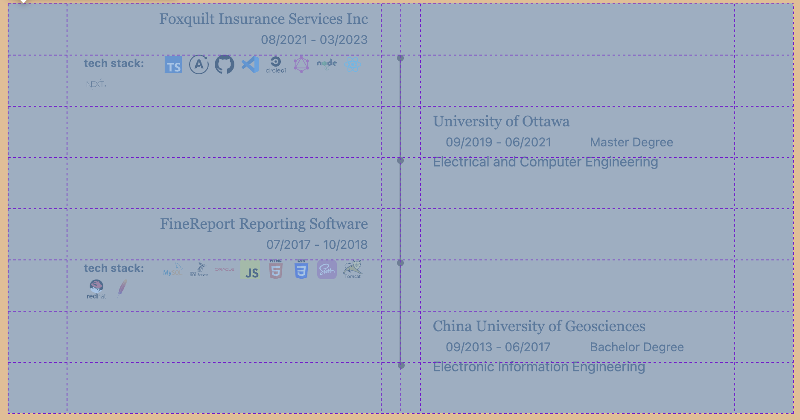

# How to use
## Prepare `CSS` through `SASS`.
1. Install `Node.js` on your computer.
2. Install `Sass` globally.
    ```bash
    npm install -g sass
    ```
3. Update `Sass` file in the `sass/icon.scss` or create another `sass` file ending with `.scss` extension.
4. Compile `Sass` to `CSS`.
    ```bash
    sass $your_sass_file $your_css_file
    ```
    or
    ```bash
    sass sass/icon.scss icon.css
    ```
5. Link the compiled `CSS` in your `HTML`.
6. Watch for changes instead of compiling it manually.
    ```bash
    sass --watch styles.scss output.css
    ```

## Add more icons
1. Go to [iconify](https://icon-sets.iconify.design/) to search icons.
2. Select `HTML`, then `CSS` tab under the icon image, then the url will appear.
3. Copy the url and paste it to `sass/icon.scss` file using the same format.
4. **Don't forget to compile the `.scss` file**.
5. Go to `js/icon.js` file and add the new icon data in the `getTechStackMap` function.
6. Then you can use it in the `addTechStack` function.
7. Additionally, other sections require the use of icons:
   *  portfolio: `js/portfolio.js`.
   *  story: `js/story.js`.

## Expand Experience Section (Story section)
All code in the experience section is dynamically generated. The CSS file `css/story.css` is generated from `sass/story.scss`, and the HTML file is generated from `js/story.js`. To make changes, modify `sass/story.scss` and `js/story.js`, rather than editing `index.html` directly.

### In `sass/story.scss`:

The CSS grid layout for the experience timeline is structured as an 8-row by 6-column grid.

* The variable `$story-section-length` in the `sass/story.scss` represents the number of rows in the grid layout, currently set to 8. The timeline length should be 6 rows.

* The `story-line` starts from row 2 and ends at the `$story-line-length` in the `sass/story.scss`. Please note that the value will automatically adjust based on the `$story-section-length` variable. There is no need for manual modification.
  * The `story-line` consists of two parts, `.story-line-left-x` and `.story-line-right-x`.

* The `story-job-card` (a.k.a `story-card-left`) starts at row `4*i - 3` and ends at row `4*i - 1`, where `i` represents the card number (a.k.a `$story-job-length` in the `sass/story.scss`).
  * The numerical suffix in the class name `.story-card-left-1` within the `css/story.css` file indicates the starting line of the job card, note that the number is not sequential.
  * Generate a tech stack ID and append more tech stack icons through `js/icon.js`.
  * To add more icons, please go to the "Add more icons" sections.
  
* The `story-school-card` (a.k.a `story-card-right`) starts at row `4*i - 1` and ends at row `4*i + 1`, where `i` represents the card number(a.k.a `$story-school-length` in the `.sass/story.scss`).
  * The numerical suffix in the class name `.story-card-right-3` within the `css/story.css` file indicates the starting line of the school card, note that the number starts from 3 and is not sequential.
  
* In order to expand the experience timeline:
  1. Increase the `$story-section-length` to expand the timeline. Ensure it provides sufficient space for accommodating additional cards.
  2. Increase the `$story-job-length` to add more job cards.
  3. Increase the `$story-school-length` to add more school cards.
  4. Compile `sass/story.scss` to update `css/story.css`.

### In `js/story.js`:
This file generates `html` code snippet and appends it to the `<div class="story" id="story">` in the `index.html`.

* `addStoryLine` function appends additional timeline components.
* `addStoryJobCard` function appends additional job card components.
* `addStorySchoolCard` function appends additional school card components.

* In order to expand the experience timeline:
  1. Adjust variables in the `sass/story.scss` first.
  2. Add more functions for adding additional story timeline components and cards.

## Add more portfolios
Instead of editing the `index.html` file directly, please use the `insertPortfolioRow` function in `js/portfolio.js` to dynamically generate the portfolio HTML snippet.
* Generate a tech stack ID and append more tech stack icons through `js/icon.js`.
* To add more icons, please go to the "Add more icons" sections.

## Add more skill bar
Instead of editing the `index.html` file directly, please use the `insertSkillRow` function in `js/skill.js` to dynamically generate the portfolio HTML snippet. Each row needs exact three components.


## Pay Attention
1. **Don't forget to compile the icon.scss**
   ```bash
   sass --watch sass/icon.scss css/icon.css 
   ```
